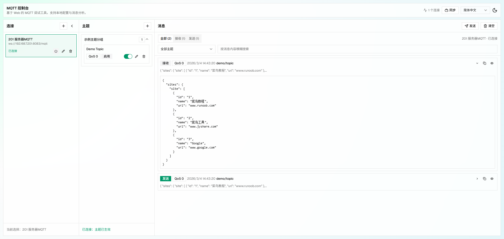
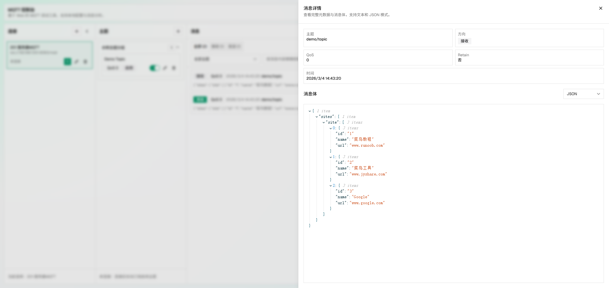
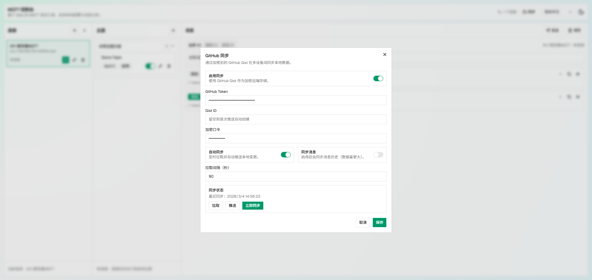

# MQTT Console

[](https://react.dev/)
[](https://www.typescriptlang.org/)
[](https://vite.dev/)
[](https://web.dev/progressive-web-apps/)
[](https://vercel.com/new)
[](./README.md)
[](./docs/README.zh-CN.md)

A web-based MQTT debugging console built with React + Vite.

It supports connection profiles, topic subscriptions, message inspection, publishing, local persistence, optional encrypted GitHub sync, and PWA installability.

## Table of Contents

1. [Overview](#overview)
2. [Features](#features)
3. [Screenshots](#screenshots)
4. [Tech Stack](#tech-stack)
5. [Quick Start](#quick-start)
6. [NPM Scripts](#npm-scripts)
7. [Deploy to Vercel](#deploy-to-vercel)
8. [Configuration Notes](#configuration-notes)
9. [GitHub Sync (Detailed Setup)](#github-sync-detailed-setup)
10. [Project Structure](#project-structure)
11. [Troubleshooting](#troubleshooting)

## Overview

MQTT Console is designed for local and remote MQTT testing workflows:

- Manage multiple broker connection profiles
- Subscribe/unsubscribe topics with QoS controls
- Publish messages quickly from a side sheet
- Inspect payloads in text/JSON views
- Store data in browser local storage
- Optionally sync encrypted data through GitHub Gist
- Install as a PWA for app-like usage

## Features

- `Connection Profiles`: Broker URL, client ID, auth, keepalive, timeout, reconnect settings
- `Topic Management`: Group topics, enable/disable subscriptions, edit/delete quickly
- `Message Center`: Direction/topic/payload filters, virtualized list, expand/copy/detail actions
- `Publish Workflow`: Topic, payload, QoS, retain controls
- `Encrypted Sync (Optional)`: Sync via GitHub Gist with passphrase encryption
- `I18n`: English / Chinese switching in UI
- `Theme`: Light and dark mode
- `PWA`: Manifest + service worker + offline asset caching

## Screenshots





## Tech Stack

- React 19
- TypeScript 5
- Vite 8
- Tailwind CSS v4
- shadcn/ui + radix-ui
- mqtt.js
- @tanstack/react-virtual
- vite-plugin-pwa

## Quick Start

### Prerequisites

- Node.js 20+ recommended
- npm 10+ recommended

### Install

```bash
npm install
```

### Run in Development

```bash
npm run dev
```

Open the URL shown by Vite (typically `http://localhost:5173`).

### Build for Production

```bash
npm run build
```

### Preview Production Build

```bash
npm run preview
```

## NPM Scripts

- `npm run dev`: start Vite dev server
- `npm run build`: type-check and build production bundle
- `npm run preview`: preview built assets locally
- `npm run lint`: run ESLint

## Deploy to Vercel

This project is ready for Vercel deployment.  
Minimal configuration is included in [`vercel.json`](./vercel.json).

### Fast Path (Fork-Friendly)

1. Fork this repository on GitHub
2. Open Vercel: `https://vercel.com/new`
3. Import your forked repository
4. Keep defaults (Framework: `Vite`, Build: `npm run build`, Output: `dist`)
5. Click `Deploy`

### Recommended Project Settings

- Framework Preset: `Vite`
- Install Command: `npm install`
- Build Command: `npm run build`
- Output Directory: `dist`
- Node.js Version: `20.x` (recommended)

### Environment Variables

- Required: none
- Optional: none (GitHub Sync is configured at runtime in the app UI)

### Auto Deploy

After binding your fork to Vercel:

- Push to your selected branch (for example `main`)
- Vercel automatically rebuilds and publishes

## Configuration Notes

### MQTT Broker URL

Use WebSocket endpoints:

- `ws://...`
- `wss://...`

### Data Persistence

Data is stored in browser local storage:

- Connections
- Topics
- Messages
- UI preferences
- Sync settings

## GitHub Sync (Detailed Setup)

Use this flow if you want cross-device encrypted sync via GitHub Gist.

1. Create a GitHub personal access token (PAT, classic):
   - Open: `https://github.com/settings/tokens/new`
   - Grant scope: `gist`
   - Copy and save the token (it is shown only once)
   - Reference: `https://docs.github.com/en/authentication/keeping-your-account-and-data-secure/managing-your-personal-access-tokens`
2. Create a Secret Gist (or let the app create one):
   - Open: `https://gist.github.com/`
   - Create a **Secret** gist with any filename (for example: `mqtt-console.sync.v1.json`)
   - Copy Gist ID from URL: `https://gist.github.com/<user>/<gist_id>`
   - You can leave Gist ID empty in app settings; it auto-creates on first `Push`
   - Reference: `https://docs.github.com/en/get-started/writing-on-github/editing-and-sharing-content-with-gists/creating-gists`
3. Fill settings in MQTT Console:
   - Open `Sync` dialog
   - Enable `Enable Sync`
   - `GitHub Token`: your PAT
   - `Gist ID`: existing ID, or empty for auto-create
   - `Encryption Passphrase`: strong passphrase (must match on all devices)
   - Optional: enable `Auto Sync` and `Sync Messages`
4. First-time recommended flow:
   - Device A (source): click `Push`
   - Device B (new): fill same token + gist ID + passphrase, then click `Pull`
5. Daily operations:
   - `Pull`: fetch remote latest
   - `Push`: upload local changes
   - `Sync Now`: execute pull + push in one action

Security notes:

- Never commit token/passphrase to source control
- Rotate token immediately if leaked
- If passphrase changes, old encrypted data cannot be decrypted by the new passphrase

## Project Structure

```text
src/
  components/                 # shared UI components
  features/mqtt-console/      # feature pages and panels
  hooks/                      # custom hooks
  i18n/                       # localization provider and messages
  lib/                        # utilities
  types/                      # type definitions
public/                       # static assets (icons, pwa files, etc.)
docs/                         # additional documents and screenshots
```

## Troubleshooting

- `PWA not updating`: hard refresh and clear site data/service worker cache
- `Cannot connect`: ensure broker supports MQTT over WebSocket with correct URL/protocol
- `No sync`: verify token (`gist` scope), gist ID, and passphrase

